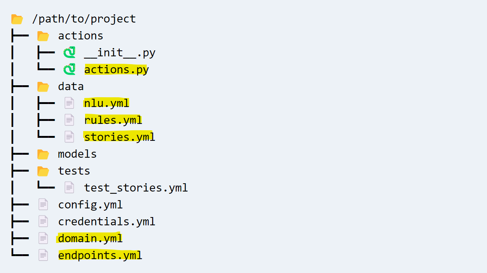
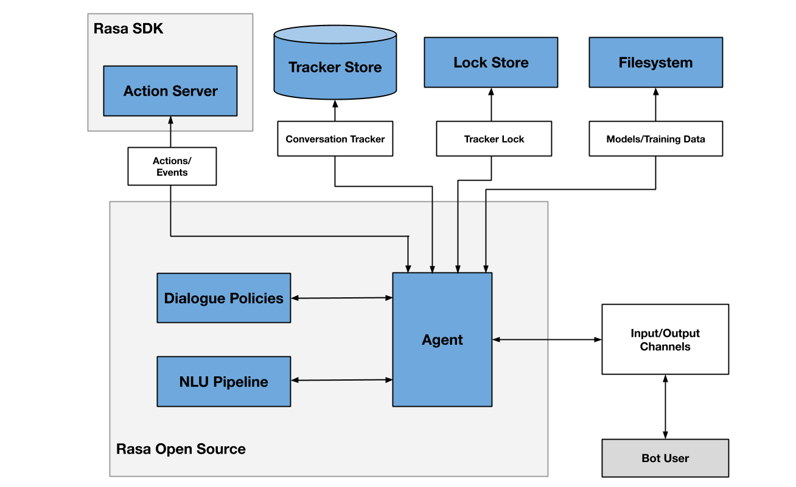
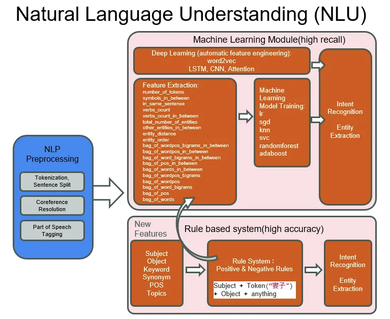
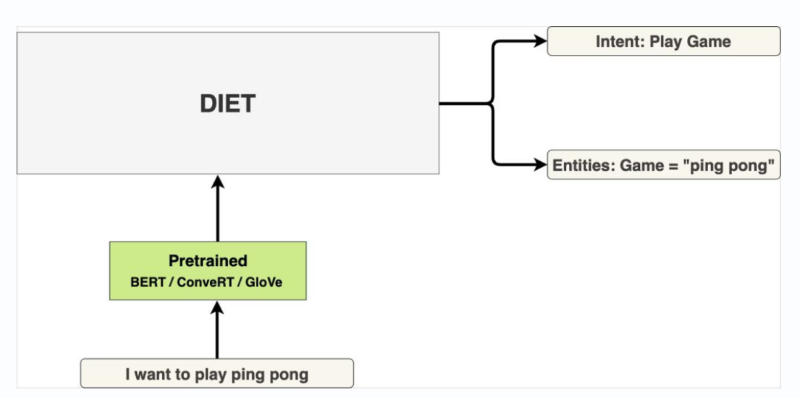
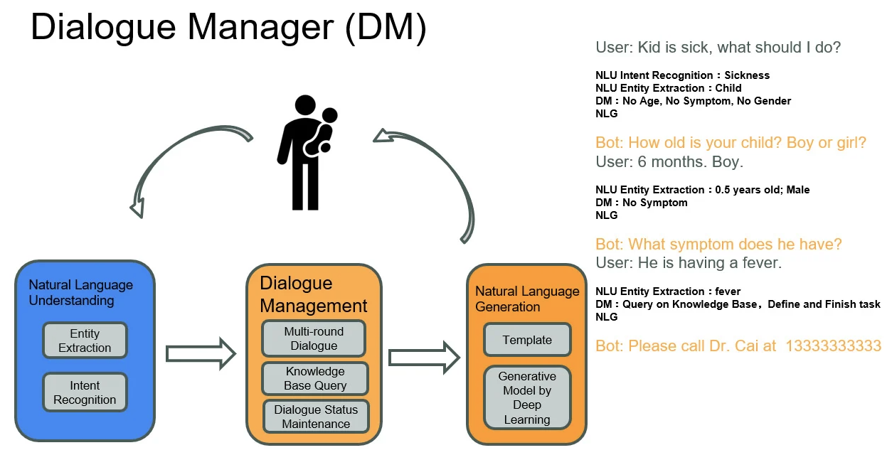

# Rasa Chatbot Hackathon
Here are the files for creating the chatbot model.  

## Installation Instructions
[Rasa open source installation instructions](https://rasa.com/docs/rasa/installation/)

```
$ git clone https://github.com/ecsricktorzynski/rasa-chatbot-hackathon
$ cd rasa-chatbot-hackathon

$ python3 -m venv ./venv
$ source ./venv/bin/activate
(venv)$ pip3 install -U pip

(venv)$ pip3 install rasa

# Add neo4j connectivity
(venv)$ pip3 install neo4j

# don't train an initial module
(venv)$ rasa init

(venv)$ git restore config.yml
```

## Starting Rasa server
```
$ source ./venv/bin/activate
$ rasa run --enable-api --model ./models --endpoints ./endpoints.yml --cors "*"
```

## Starting Rasa Action server
If custom actions are being used, then a separate rasa action server has to be started to handle actions.

```
# open separate terminal
$ source ./venv/bin/activate
$ rasa run actions
```

## Rasa Commands
```
# to create new chatbot
(venv)$ rasa init

# train chatbot after changes
(venv)$ rasa train

# run chatbot in shell
(venv)$ rasa shell

# run chatbot as a service
(venv)$ rasa run --enable-api --model ./models --endpoints ./endpoints.yml --cors "*"

# show help
(venv)$ rasa -h

# show extra log output when debugging
(venv)$ rasa --debug

```

## Rasa File Structure



## Rasa Architecture



## Rasa NLU



## Rasa DIET
Rasa's Dual Intent Entity Transformer (DIET) technology is used for entity extraction and intent recognition.



## Rasa Dialogue Manager (DM)



## Additional Resources
[Rasa Documentation](https://rasa.com/docs/)

[Rasa Learning Center](https://learning.rasa.com/)

This is documentation for developers providing good explanations of NLP and explaining Transformers in a relatively simple way.

[Rasa YouTube Channe](https://www.youtube.com/channel/UCJ0V6493mLvqdiVwOKWBODQ                                                                                          )

# Tasks for Hackathon

1. Install Rasa
2. Train Rasa model
3. Use Rasa shell to talk to chatbot
4. Add Intents and Entities
5. Use Flask for web interface
6. Add a Form 
7. Add a Form with text slots
8. Add a custom action to get current time
9. Add a custom action to access Neo4j
10. Add a custom action with confirmation
11. Add hackathon custom actions


